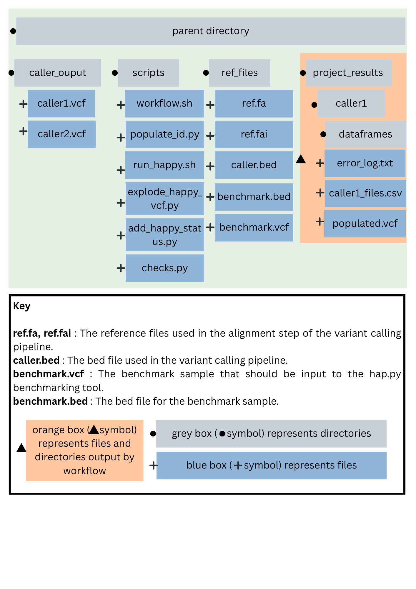

# Purpose of workflow
 
An automated workflow which transforms variant call format (VCF) files into dataframes for data exploration. To support comparison of variant caller performance, the workflow also runs the hap.py benchmarking tool so that variants called can be benchmarked to a gold standard.
 
# Main workflow steps

## populate_id.py

populates a unique id to each variant record (added to the INFO column) so that they can be tracked throughout the workflow. Updates the header.

output: populated_my_id_passonly.vcf and populated_my_id.vcf
 
## map_vcfs.py

parses the vcf file into a dataframe, explodes the FORMAT and END columns so that metrics within them are put into their own dataframe columns. Extracts the unique id from the INFO column and puts it into its own column.

output: [caller_name]_dataframe.tsv

## run_happy.sh
 
Run the hap.py tool to benchmark the vcf against a gold standard vcf file.

output: results from happy benchmarking tool in 'happy' directory
 
## explode_happy_vcf.py

parses the output vcf from happy into a dataframe. This dataframe includes the ‘result’ from happy benchmarking in each variant record.

output: [caller_name]_exploded_happy_dataframe.tsv
 
## add_happy_status.py

merge the dataframes on ‘my_id’ values. This merged dataframe is a combined dataframe that can be used for data exploration.

output: [caller_name]_merged_happy_dataframe.tsv

## checks.py [under development]

A script which runs some checks on the merged dataframe to help with data exploration.
 
For example, whether the variant record overlaps with the bed file used in the happy benchmarking step.

output: [caller_name]_checked_dataframe.tsv

# Input

The required file structure for the workflow to work is documented in the figure below.



The required inputs are:
 
## In the ‘caller_output’ directory

- A vcf file to transform into a dataframe and benchmark (named `[caller_name].vcf`)

**Note:** multiple vcf files can be stored in this directory, but the workflow must be run separately for each.

## In the ‘ref_files’ directory

- `ref.fa` and `ref.fai` : The reference files used in the alignment step of the variant calling pipeline.
- `caller.bed` : The bed file used in the variant calling pipeline.
- `benchmark.vcf` : The benchmark sample that should be input to the hap.py benchmarking tool.
- `benchmark.bed` : The bed file for the benchmark sample.

# How to Run

1. Create a `parent_directory` for the workflow to run in.
2. Within the `parent_directory` create a `ref_files` directory and a `caller_output' directory.
3. Copy over vcf input files (as described in the input section above) into the `caller_output` directory.
4. Copy over reference files (as described in the input section above) into the `ref_files` directory.
5. Clone this directory into the `parent_directory`.
6. Run the below command to initiate the workflow for each variant caller.
 
```bash

path/to/research_project_scripts/workflow.sh  path/to/parent_directory  'variant_caller_name'

```

**Note:** variant caller name should match the relevant `[caller_name].vcf` in the `caller_output` directory.


For example, for the `deepvariant.vcf` the command would be:
 
```bash

path/to/research_project_scripts/workflow.sh  path/to/parent_directory  'deepvariant'

```
 
# Software Requirements

 
- hap.py (v0.3.15)

- numpy-2.2.5

- pandas-2.2.3

# Future Developments


- `variants_to_investigate.py` and `compare_happy_output.py` are still under development and are not integrated into `workflow.py`.

- `workflow.sh` requires specific naming patterns for directories and filepaths. I would like to create command line parameters so that these names can be set by the user.

- 'checks.py' only does minimal sense checks and counts so has limited utility at this time.